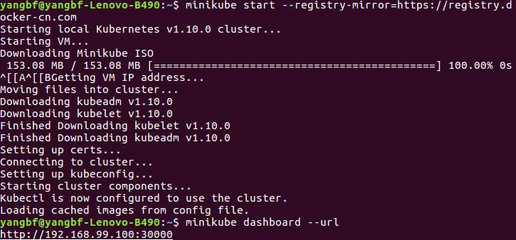

# [linux 安装minikube](https://yq.aliyun.com/articles/221687)

## 准备
* [kubectl](https://kubernetes.io/docs/tasks/kubectl/install/?spm=a2c4e.11153940.blogcont221687.19.7dd57733bvicmQ)
* [VirtualBox](https://www.virtualbox.org/wiki/Downloads?spm=a2c4e.11153940.blogcont221687.23.7dd57733bvicmQ)
* minikube

## 安装kubectl[国内](https://blog.csdn.net/faryang/article/details/79427573)
* 直接下载[kubectl](https://dl.k8s.io/v1.10.5/kubernetes-client-linux-amd64.tar.gz)
    ```
    wget https://dl.k8s.io/v1.9.3/kubernetes-client-linux-amd64.tar.gz
    tar -zxvf kubernetes-client-linux-amd64.tar.gz
    cd kubernetes/client/bin
    chmod +x ./kubectl
    sudo mv ./kubectl /usr/local/bin/kubectl
    ```
## 安装minikube
```
curl -Lo minikube http://kubernetes.oss-cn-hangzhou.aliyuncs.com/minikube/releases/v0.28.0/minikube-linux-amd64 && chmod +x minikube && sudo mv minikube /usr/local/bin/
```

## 部署kubetnetes环境
```
$ minikube start --registry-mirror=https://registry.docker-cn.com
# 查看minikube状态
$ minikube status
```
执行成功如图：



## [部署应用](./deploy_app.md)