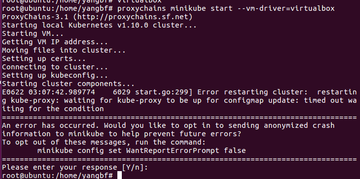

# 按官方[教程](https://kubernetes.io/docs/setup/minikube/)来
[参考](https://www.jianshu.com/p/26d0ebd86673)

代理使用proxychains

## docker 使用代理
```
$ mkdir -p /etc/systemd/system/docker.service.d
$ touch /etc/systemd/system/docker.service.d/http-proxy.conf
#/etc/systemd/system/docker.service.d/http-proxy.conf 内容
[Service]
Environment="HTTP_PROXY=http://proxy.example.com:80/"
或 Environment="ALL_PROXY=socks5://127.0.0.1:1080"

#重启systemd
$ sudo systemctl daemon-reload
#验证配置
$ systemctl show --property=Environment docker
Environment=HTTP_PROXY=http://proxy.example.com:80/  #打印内容
#重启docker
$ sudo systemctl restart docker
```
minikube start --vm-driver=virtualbox
## minikube start 后
* kubectl get nodes 获取node节点，这里只有一个单节点
* kubectl get pod -o wide --all-namespaces  查看所有运行的容器
* kubectl describe podName -n kube-system 查看kube-system空间内的名为podName的执行过程详情，可用于定位问题
* minikube status 查看local kubernetes cluster status
* minikube ip 查看ip 例如：这里得到ip为192.168.99.100
* minikube dashboard --url 查看dashboard url 例如：这里得到http://192.168.99.100: 31512
* minikube ssh 登录到virtualbox的系统中，可以查看到docker images下载的gcr.io的镜像，以及docker ps
* minikube get-k8s-versions 获取kubernetes版本列表
* minikube start --kubernetes-version v1.7.3 以某一个kubernetes版本启动集群
* eval $(minikube docker-env) 通过这个命令就可以在minikube所在的虚拟机，直接运行docker来查看镜像和运行的容器，这样就可以不需要minikube ssh再查看docker信息
* minikube service serviceName --url 可以查看到service的访问url


## ERROR



minikube start kubectl run hello-minikube --image=registry.cn-hangzhou.aliyuncs.com/google-container/echoserver:1.4 --port=8080 kubectl expose deployment hello-minikube --type=NodePort kubectl get pod