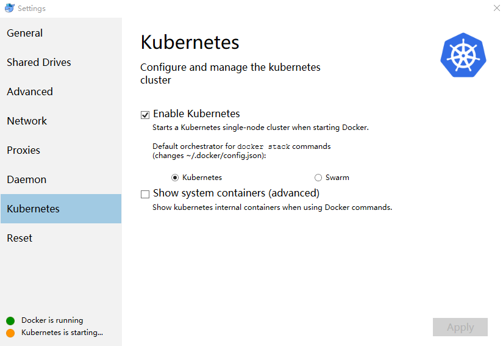

[Docker CE for Windows(Edge)](https://download.docker.com/win/edge/Docker%20for%20Windows%20Installer.exe)
edge版自带k8s,默认关闭，需要手动启动

**安装kubernetes需要下载相关依赖，需要[解决网络问题](https://yq.aliyun.com/articles/508460?spm=a2c4e.11153940.blogcont221687.18.7dd57733KyRIhf)**